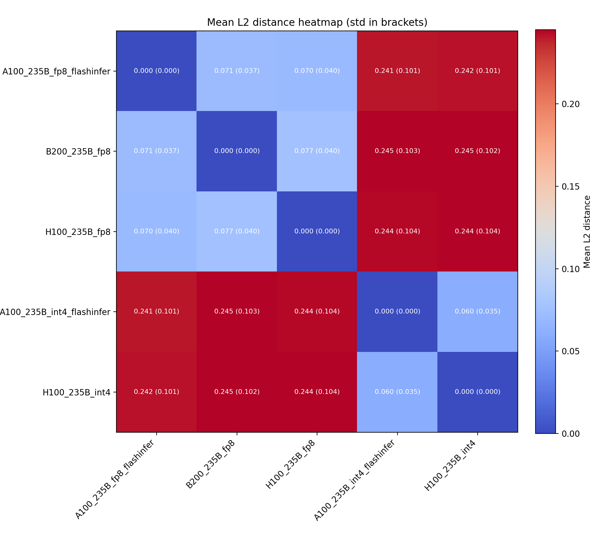
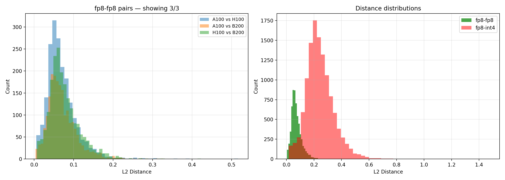
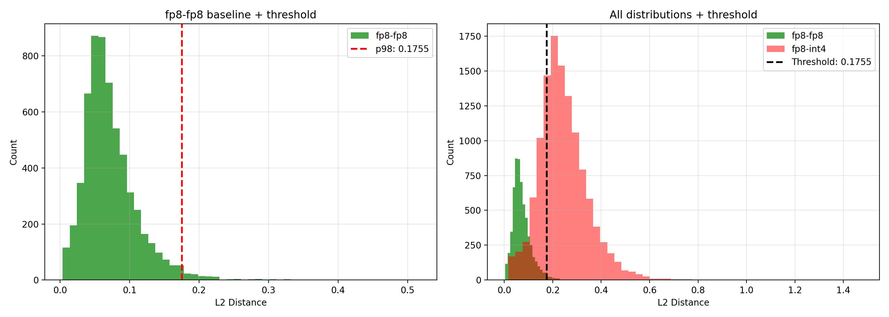

## PoC V2 Validation Report

### Context
In each PoC, every participant produces a set of nonces with corresponding vectors. We need to make sure that the nonce-vector pairs that a participant reports as a proof of compute was produced honestly with the model `Qwen/Qwen3-235B-A22B-Instruct-2507-FP8`.

To ensure honest behaviour we need to validate the Proof of Compute.

In the validation procedure:
- A verifier requests a subset of nonce-vector pairs.
- The verifier recomputes the vectors from the given nonces locally and compares to the received vectors.
- For each nonce we compute an L2 distance. If it exceeds a threshold, that nonce is counted as a **mismatch**, meaning verifier could reproduce the computation that participant claimed to conduct.

Because of GPU non-determinism we will always observe some level of mismatches. The core question: **Are mismatch rates consistent with honest behavior?** If not, flag the participant/pair as suspicious.

This report describes:

- **How data was collected** for cross-machine comparison (conceptually)
- **What we measured** (distance distributions between “honest” runs on different machines)
- **How the mismatch rule is defined** (thresholding distances)
- **How we aggregate evidence** across many nonce checks (binomial test + weighted voting intuition)

---

### Experiments & data collection (how data was collected)
Data was collected with [`vllm/scripts/collect_data.py`](../collect_data.py).

#### Collection flow (per server)
For each participant/server, the script:

- Runs the PoC generation for a **fixed list of nonces** (a deterministic nonce set, so runs can be compared).
- Collects the returned **artifacts** (nonce + vector output), and decodes vectors into numeric arrays for analysis.
- Saves one result file per server (and per seed when multiple seeds are used), so that we can later compare servers **offline** without querying them again.

---

### Experimental setup (runs compared)
We compared multiple participants running the same PoC pipeline across different hardware and numerical formats, to understand what “honest variation” looks like.

Concretely, we compared:

- **FP8 runs** on H100, B200 and A100 (expected to be close to each other under honest behavior).
- **INT4 runs** as a second cluster.
- **A100** is included as an important reference point: it does not support FP8 in the same way as H100, so comparing A100-based outputs against Р100 FP8 runs helps quantify the **maximum distances we might see even without malicious intent** (i.e., hardware-induced divergence).

The detailed run metadata lives in [`vllm/scripts/notebooks/analyze_data_poc2.ipynb`](analyze_data_poc2.ipynb), but the key takeaways are summarized below.

---

### Measured distance distributions (pairwise)
For each pair of runs, we compared vectors **nonce-by-nonce** (same nonce, two machines) and computed the L2 distance.

This gives a distribution of distances for each pair, answering: “If both are honest, how far apart can their vectors be purely due to hardware / numeric differences?”
We expect distances to cluster into groups (e.g., FP8-with-FP8 vs FP8-with-INT4), and that separation is what allows a simple mismatch rule.
The heatmap and histogram below visualize this separation.

Below are the printed pairwise summaries (mean ± std, max):

| Pair | mean ± std | max |
|---|---:|---:|
| A100_int4 vs A100_fp8 | 0.241144 ± 0.100893 | 1.0961 |
| A100_int4 vs H100_fp8 | 0.243977 ± 0.104461 | 1.4753 |
| A100_int4 vs H100_int4 | 0.059914 ± 0.035187 | 0.2957 |
| A100_int4 vs B200_fp8 | 0.244649 ± 0.102523 | 1.3202 |
| A100_fp8 vs H100_fp8 | 0.070354 ± 0.040487 | 0.5167 |
| A100_fp8 vs H100_int4 | 0.241756 ± 0.100651 | 0.8875 |
| A100_fp8 vs B200_fp8 | 0.070842 ± 0.037405 | 0.3272 |
| H100_fp8 vs H100_int4 | 0.244396 ± 0.103905 | 1.2914 |
| H100_fp8 vs B200_fp8 | 0.077150 ± 0.040208 | 0.4224 |
| H100_int4 vs B200_fp8 | 0.245051 ± 0.101769 | 1.1198 |

**Observation:** FP8↔FP8 and INT4↔INT4 pairs cluster at lower distances (~0.06–0.08), while INT4↔FP8 pairs cluster at much higher distances (~0.24). This separation is what enables a distance-based mismatch rule.

---

### Threshold calibration + mismatch rule
To decide whether a single nonce comparison “looks honest”, we need a threshold that tolerates normal GPU non-determinism but still catches large deviations.

We do this by learning what distances look like for runs we consider honest (the “honest distance distribution”), and then choosing a conservative cutoff:

- We set the threshold so that **only ~2%** of honest distances exceed it (a 98th-percentile cutoff).
- In the captured experiment, this produced a threshold of **0.173663**.
- When applied back to the honest samples used for calibration, the observed mismatch rate is **2.0%** (160 out of 8000 nonce comparisons).

This makes the interpretation simple: for an honest participant, we expect “a few mismatches” just from noise; cheating (or major incompatibility) should drive that mismatch rate much higher.

#### Final mismatch classification rule
For any checked nonce:

- **mismatch := (L2_distance > dist_threshold)**

This produces an expected mismatch probability of ~2% under honest behavior (by construction).

---

### Statistical validation rule (binomial mismatch test)
For a validator comparing a target participant’s vectors to its own recomputation (or, equivalently, comparing participant A vs B on the same nonces), we collect:

- `N = number of checked nonces`
- `k = number of mismatches` (distances above threshold)

Under the honest null hypothesis, `k ~ Binomial(N, fp_rate)` with `fp_rate ≈ 0.02`.

We then run a **one-sided** binomial test (`alternative="greater"`) to detect *higher-than-expected* mismatch rates.

Example outputs from the notebook (N=2000 per pair):

- INT4↔FP8 pairs show ~77% mismatches and are decisively flagged (p≈0).
- FP8↔FP8 pairs are mostly consistent with ~2% (e.g., 35/2000 = 1.8%, p=0.809).

---

### Cheater simulations (intuition + aggregation)
The notebook includes simulations to answer a practical question: **even if a participant is honest, what are the odds that randomness/noise makes them look suspicious?** And conversely: **how quickly does the method become convincing when the participant is actually dishonest?**

The simulations cover three layers:

- **Single validator intuition (fixed-count sweep):** we model a validator checking 200 random nonces and vary the number of mismatches. This shows how p-values behave: a small number of mismatches is normal, but as the mismatch count grows beyond what we expect under honesty, the p-value drops rapidly.

- **Cheater-rate Monte Carlo (2% vs 4%):** instead of fixing the mismatch count, we assume a true mismatch probability and repeatedly simulate what a validator would observe for 200 checks. In one run with **1000 simulations** at **4% true mismatch rate**, about **51.5%** of samples produced a one-sided p-value below **0.05** (515/1000). This shows that even a modest increase (2% → 4%) becomes detectable, but not deterministically so at this sample size.

- **Network aggregation with weights (majority of stake):** validators have different voting weights. We simulated **377 participants** with their real weight distribution and ran **100,000 rounds** per scenario (each validator checks 200 nonces and votes “cheater” if its p-value < 0.05).\n\n  
    - **Honest target (2%)**: the median **weight share voting “cheater”** was **4.13%** (95th percentile **12.34%**, max observed **26.43%**). The probability that an honest target is marked cheater by **>50% weight** was **0/100,000** in the simulation.\n  
    - **Dishonest target (4%)**: the median cheater-vote weight share was **55.11%** (95th percentile **67.05%**). The network reached **>50% weight** cheater votes in **73.563%** of rounds.
    
**Conclusion:** with these settings (200 checks per validator, alpha=0.05, 50% weight quorum), false conviction of an honest target appears extremely unlikely, while a 4% mismatch-rate target is excluded in a large fraction of rounds.

---

### Reproducibility pointers
- Data collection: [`vllm/scripts/collect_data.py`](../collect_data.py)
- Analysis notebook: [`vllm/scripts/notebooks/analyze_data_poc2.ipynb`](analyze_data_poc2.ipynb)
- Collected artifacts: [GDrive link](https://drive.google.com/drive/folders/1-zZ67x2N2PCxamZuuBI_OJulYxPJ0i1a?usp=sharing)
- Figures used in this report: `vllm/scripts/notebooks/report_assets/` (commit these PNGs alongside the report so GitHub can render them)
